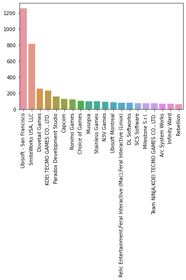
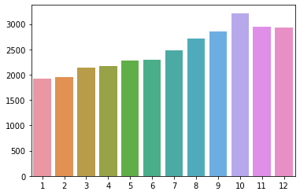
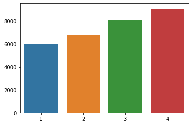

# Steam Recommendation System:

by Jake Ash

# Overview
This project contains the work of developing a recommendation system for the video game digital distribution site, Steam.

# Business Problem
Video game sales peak during the winter holiday season, but fall off for the rest of the year. Can a recommendation system be created to drive sales year round for the game distribution companies? 
While this is the main goal, the recommendation system has other implimentations as well. It can also provide exposure for small, Indie game companies when it recommends their product to other users. They can also push their marketing campaign onto the users that get recommended their game.
 
 
As we can see in the graph above, AAA studios like Ubisoft dominate the game market. This makes it harder for the average user to find a lesser known indie games that may be the perfect game for them.
# Data
The data was provided by Julian McAuley, an associate professor at University of California San Diego. The website provides 4 datasets in JSON format, which include:
* reviews
* purchases, plays, recommends ("likes")
* product bundles
* pricing information
This data can be reformatted to recommend new games based on the games the user already owns.
https://cseweb.ucsd.edu/~jmcauley/datasets.html#steam_data

# Data Cleaning
The data provided is saved in JSON format, however it uses ' instead of " when saving information. Luckily, Professor McAuley includes a short code snippit that properly retrieves the information for you. Then, this saves the data to a pandas DataFrame. From here, I then reformat the data to retrieve the game id, and create a new user_id. Following this, I then merge explode the game id list in the dataframe, so each game gets its own row in the dataframe. We can then work with this new dataframe for modeling

# EDA
Now, lets look at some of the trends in the data. Here, we can see which months sell the most amount of video games:
 

 
This shows that the winter months sell the most amount of games, and how little the beginning of the year sells. Creating this recommendation system will drive sales throughout the year.
 

 
Here, we have the same data but viewed as quarterly. We can see the steep drop during Q1, compared to Q4, so this system will suggest games to users during this time to increase Q1 sales.
# Model Selection

I create multiple Collaborative Filtering Models. However, a majority of these models predict 1's for every column instead of finding commonalities. So, the three models that actually predict values, SVD NMF and SVD++, are the 3 models that are compared. After finding their RMSE, SVD++ has the lowest, so that will be the model we use.
 

 

# Predictions

Lets create a new user that enjoys shooter/strategy games. We willl make their library to have these 5 games - Counter Strike: Global Offensive, Left for Dead 2, Borderlands 2, PAYDAY 2, and Warframe. The model recommends the user to try out the following games: Team Fortress Classic, Day of Defeat: Source, Deus Ex: Game of the Year Edition, Half-Life 2, and Joint Task Force. After looking up these games, they are all shooters or stategy games. The biggest flaw in this model, however, is that the games it recommends tend to be on the older side. In the future, I would like to recommend newer games over older games.
 

# Next steps
First, I need to finish running the hyper-parameter RandomizedSearchCV so I can add the correct paramters to the SVD++ model. Like stated before, I would also like to recommend newer games over older games. I would like to create a front-end using streamlit. On top of this, I would also like to create a content based recommendation system to suggest games that are similar to the one that is given. Finally, I would like to use the Steam API to get up-to-date information about users and games.

# Citation:

* Self-attentive sequential recommendation
Wang-Cheng Kang, Julian McAuley
ICDM, 2018

* Item recommendation on monotonic behavior chains
Mengting Wan, Julian McAuley
RecSys, 2018

* Generating and personalizing bundle recommendations on Steam
Apurva Pathak, Kshitiz Gupta, Julian McAuley
SIGIR, 2017